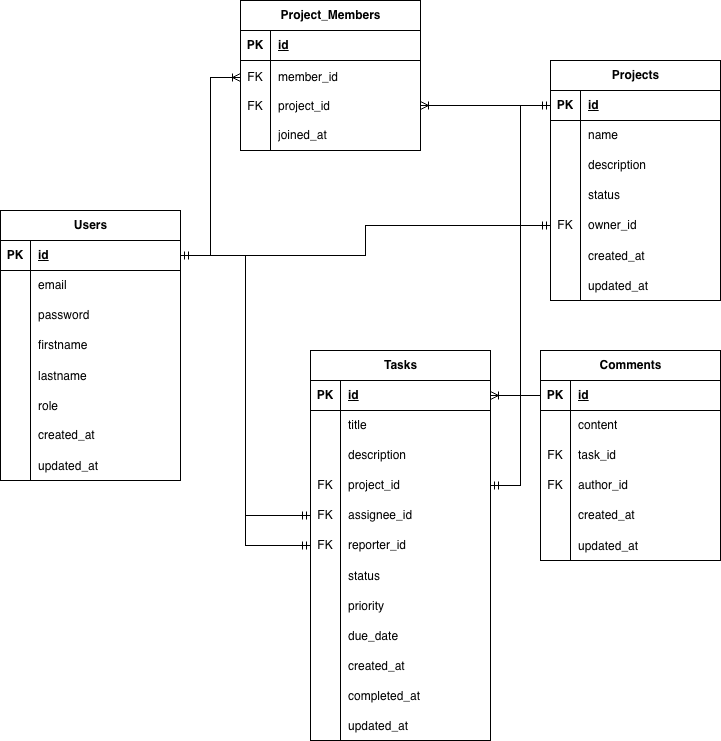

# Database Schema Design

## Overview
This document explains the database schema for the Task Management System.

## Entity Relationship Diagram

## Tables

### Users
Stores user account information and authentication data.

**Key Decisions:**
- Email is unique (used for login)
- Password stored as BCrypt hash
- Role enum: USER or ADMIN
- Soft delete not implemented (hard delete for simplicity)

### Projects
Represents a project container for tasks.

**Key Decisions:**
- Each project has one owner (creator)
- Projects can have many members (many-to-many via project_members)
- Status: ACTIVE or ARCHIVED (soft delete alternative)

### Tasks
The core entity - represents a task/ticket.

**Key Decisions:**
- Belongs to exactly one project (cannot be orphaned)
- Can have one assignee and one reporter
- Assignee are nullable (unassigned tasks allowed)
- Reporter is always the creator of the ticket and not nullable
- Status: TODO → IN_PROGRESS → DONE
- Priority: LOW, MEDIUM, HIGH, URGENT
- Due date is optional

**Indexes:**
- project_id: For listing tasks by project
- assignee_id: For "my tasks" queries
- status: For filtering by status
- due_date: For sorting by deadline
- created_at/completed_at: For sorting by creation/completion date

### Comments
Allows discussion on tasks.

**Key Decisions:**
- Belongs to one task
- Has one author
- Simple structure (no threading/replies)
- Cascade delete when task is deleted

### Project Members (Junction Table)
Implements many-to-many relationship between users and projects.

**Key Decisions:**
- Composite primary key (project_id + member_id)
- Prevents duplicate memberships
- Cascade delete when project or user is deleted

## Relationships

1. **User → Task (as assignee)**: One-to-Many
    - A user can be assigned to many tasks
    - A task has at most one assignee

2. **User → Project (as owner)**: One-to-Many
    - A user can own many projects
    - A project has exactly one owner

3. **User ↔ Project (as member)**: Many-to-Many
    - A user can be member of many projects
    - A project can have many members

4. **Project → Task**: One-to-Many
    - A project contains many tasks
    - A task belongs to one project

5. **Task → Comment**: One-to-Many
    - A task can have many comments
    - A comment belongs to one task

## Future Enhancements

Potential additions for later:
- Task attachments table
- Task tags/labels (many-to-many)
- Activity/audit log table
- Task history/revisions
- Notifications table